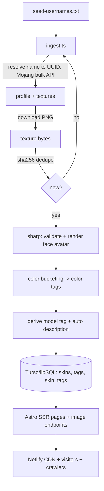

# Technical Specification — Skinora (Minecraft Skin Site)

## 0. Summary & Complexity

**Goal:** A clean, professional, low-maintenance Minecraft skin website monetized with ads.
It automatically ingests skins (no hand-curation), exposes a NameMC-style browse experience
where **every skin is an indexable URL**, and is built to scale to thousands of SEO pages
with minimal ongoing effort.

**Complexity: hard.** Multiple subsystems (automated ingestion pipeline, database, blob/image
serving, 3D rendering, SEO at scale, ad integration) plus external-API and legal caveats.

---

## 1. Technical Context

### 1.1 Confirmed decisions (from user)
1. **Skin source:** Seed username list + Mojang API ingestion, store textures locally.
2. **Hosting:** Netlify. Local testing for now. Stack choice delegated to us (Netlify-friendly).
3. **Rendering:** `skinview3d` 3D viewer + self-hosted textures.
4. **Ads:** Network-agnostic ad slots, AdSense default, placeholders until publisher ID exists.
5. **Auto-tagging:** Basic — model type (classic/slim) + dominant colors.

### 1.2 Chosen stack (and rationale)

| Concern | Choice | Why |
|---|---|---|
| Framework | **Astro 4 (TypeScript)** | Ships near-zero JS by default → fast, great Core Web Vitals (key for ad revenue + SEO). Islands let us load `skinview3d` only on the detail page. First-class Netlify support. Ideal for thousands of indexable content pages. |
| Rendering mode | **On-demand SSR via `@astrojs/netlify`** | Skins grow continuously; static-building thousands of pages on every deploy is slow. On-demand server rendering reads from the DB so new skins are live without a rebuild. CDN-cached responses keep it cheap. |
| Styling | **Tailwind CSS** (`@astrojs/tailwind`) | Clean, professional UI with minimal custom CSS and low maintenance. |
| Database | **Turso (libSQL / SQLite)** via `@libsql/client` | Serverless SQLite, generous free tier, works perfectly with Netlify Functions, read-heavy friendly, near-zero ops. Local dev uses a local libSQL file — no cloud needed to test. |
| ORM / migrations | **Drizzle ORM** + **drizzle-kit** | Type-safe schema + queries, simple SQL-first migrations. |
| Texture storage | **PNG bytes stored as BLOB in DB**, served via app endpoints | Skins are tiny (64×64 PNG, ~1–6 KB). Avoids external object storage and repo bloat; "self-hosted" per requirement; served with long-lived immutable cache headers behind Netlify CDN. |
| 3D viewer | **`skinview3d`** (client island, detail page only) | Interactive NameMC-style preview without burdening grid pages. |
| Image processing (ingest only) | **`sharp`** | Decode/validate textures, render 2D face avatars, extract pixel data for color bucketing. Runs only in the local ingestion script — **not** a runtime dependency on Netlify. |
| HTTP (ingest) | Native `fetch` (Node ≥ 18) | No extra deps. |
| Tooling | ESLint + `eslint-plugin-astro`, Prettier + `prettier-plugin-astro`, `astro check` | Type + lint gates for "bug free". |

### 1.3 Runtime/version assumptions
- Node.js ≥ 18 (for global `fetch`; 20 LTS recommended).
- Package manager: npm.
- All Mojang calls happen **only during ingestion** (a local/offline script), never at request time → no per-visit rate-limit exposure.

### 1.4 Legal / risk caveats (carried into build)
- Skins are user-generated content. We store source `username`/`uuid` for attribution, expose a
  takedown/contact path (`/contact`), and keep an auditable `texture_hash`.
- `robots.txt` + sitemaps target our own skin pages only.
- Mojang endpoints are rate-limited; ingestion uses batching, delays, and backoff and is fully
  idempotent (safe to re-run).

---

## 2. Implementation Approach

### 2.1 Data flow


### 2.2 Ingestion pipeline (`scripts/ingest.ts`)
For each username in the seed list:
1. **Resolve** username → UUID via Mojang bulk endpoint `POST https://api.mojang.com/profiles/minecraft` (up to 10 names/request).
2. **Fetch profile** `GET https://sessionserver.mojang.com/session/minecraft/profile/{uuid}`; base64-decode the `textures` property → skin URL (`textures.minecraft.net/...`) and model (`SLIM` → slim, else classic).
3. **Download** the texture PNG (bytes).
4. **Dedupe** by `sha256(texture bytes)` against `skins.texture_hash`; skip if present.
5. **Validate/normalize** via `sharp` (must be 64×64 or legacy 64×32 PNG).
6. **Render face avatar** (8×8 head region + hat overlay, scaled to 128×128, nearest-neighbor) → PNG bytes.
7. **Color bucketing** (`src/lib/colors.ts`): downsample body pixels, ignore transparent, quantize into a fixed palette (e.g., red, orange, yellow, green, blue, purple, pink, brown, black, white, gray) + derived tags (`dark`, `light`, `colorful`, `monochrome`).
8. **Tags:** model tag (`classic`/`slim`) + top N color tags.
9. **Auto description** (`src/lib/description.ts`): deterministic template from metadata.
10. **Slug:** `{sanitized-username}-{first8(texture_hash)}` (stable, unique, human-readable).
11. **Upsert** skin row + texture/avatar blobs; upsert tags; link `skin_tags`.

Controls: configurable concurrency (default low), inter-request delay, exponential backoff on
429/5xx, resumable, idempotent. CLI: `npm run ingest -- --file scripts/seed-usernames.txt --limit N`.

### 2.3 Rendering & caching strategy
- **Detail page (`/skin/[slug]`):** SSR HTML + a `skinview3d` island that lazy-loads and fetches `/api/texture/{slug}.png`. CDN-cacheable (e.g., `s-maxage`, stale-while-revalidate).
- **Grids:** plain `` pointing at `/api/avatar/{slug}.png` (cheap, fast LCP). No WebGL in grids.
- **Image endpoints:** `Cache-Control: public, max-age=31536000, immutable` (slug embeds content hash).
- **`/random`:** server selects fresh random rows per load (`ORDER BY RANDOM() LIMIT n`); **not** cached. A "Refresh" control fetches `/api/random.json` and swaps the grid (fallback: full reload).

### 2.4 Ads
- `AdSlot.astro` is network-agnostic: takes a `slot`/`format` prop. If `PUBLIC_ADSENSE_CLIENT`
  is set it renders the AdSense `<ins>` unit + loads the script once; otherwise it renders a
  labeled placeholder box (so layout/CLS is identical with or without ads).
- Placements: top of content + between grid rows (every N cards) + one in detail-page sidebar/below preview.

### 2.5 SEO at scale
- Per-page `<Seo>` component: title, meta description, canonical, OpenGraph/Twitter (og:image = avatar endpoint), JSON-LD `ImageObject` on skin pages.
- `robots.txt` (allows crawl, points to sitemap index).
- **Sitemap index** + chunked child sitemaps (≤ 5,000 URLs each) generated from DB so thousands of skin URLs stay discoverable.
- Stable, lowercase, hyphenated slugs; 404 for unknown slugs.

---

## 3. Source Code Structure (all new — greenfield)

```
skinora/
  package.json
  astro.config.mjs
  tsconfig.json
  netlify.toml
  drizzle.config.ts
  .env.example
  .eslintrc.cjs / eslint.config.mjs
  .prettierrc
  README is NOT created unless requested
  db/
    migrations/                  # drizzle-kit output
  scripts/
    ingest.ts                    # ingestion pipeline (Node)
    seed-usernames.txt           # sample seed list
  src/
    layouts/
      BaseLayout.astro           # html shell, Seo, header/footer, global styles
    components/
      Header.astro
      Footer.astro               # contact / privacy / ad-preferences links
      Seo.astro                  # meta + OG + JSON-LD
      AdSlot.astro               # network-agnostic ad unit / placeholder
      SkinCard.astro             # avatar img + name + tags, links to detail
      SkinGrid.astro             # responsive grid + interleaved AdSlots
      Pagination.astro
      SkinViewer.tsx             # skinview3d island (client:visible)
      RefreshButton.tsx          # /random refresh island (or inline script)
    lib/
      db/
        client.ts                # libSQL client (env-driven; local file fallback)
        schema.ts                # drizzle tables
        queries.ts               # getRandomSkins, getSkinBySlug, getSkinsByTag,
                                 #   getTag, listTags, counts, allSlugsForSitemap
      colors.ts                  # palette + bucketing (shared ingest/runtime-safe)
      description.ts             # auto description generator
      seo.ts                     # canonical/meta helpers, site constants
    pages/
      index.astro                # home: recent + random teaser + ads
      random.astro               # random grid + Refresh
      skin/[slug].astro          # detail: 3D viewer, metadata, description, tags, ads
      tag/[tag].astro            # paginated grid by tag
      contact.astro
      privacy.astro
      ad-preferences.astro
      robots.txt.ts
      sitemap-index.xml.ts
      sitemap/[page].xml.ts
      api/
        texture/[slug].png.ts    # serve raw skin PNG blob
        avatar/[slug].png.ts     # serve rendered face avatar PNG blob
        random.json.ts           # JSON for Refresh button
```

---

## 4. Data Model

### 4.1 `skins`
| column | type | notes |
|---|---|---|
| `id` | INTEGER PK AUTOINCREMENT | |
| `slug` | TEXT UNIQUE NOT NULL | `{username}-{hash8}` |
| `texture_hash` | TEXT UNIQUE NOT NULL | sha256 hex of texture bytes (dedupe) |
| `source_username` | TEXT | attribution |
| `source_uuid` | TEXT | attribution |
| `model` | TEXT NOT NULL | `'classic'` \| `'slim'` |
| `texture` | BLOB NOT NULL | original skin PNG |
| `avatar` | BLOB NOT NULL | rendered face PNG |
| `tex_width` / `tex_height` | INTEGER | 64×64 or 64×32 |
| `description` | TEXT NOT NULL | auto-generated |
| `created_at` | INTEGER NOT NULL | epoch ms (added time) |

Indexes: unique(`slug`), unique(`texture_hash`), index(`created_at`).

### 4.2 `tags`
| column | type | notes |
|---|---|---|
| `id` | INTEGER PK | |
| `slug` | TEXT UNIQUE NOT NULL | `red`, `dark`, `slim`, ... |
| `name` | TEXT NOT NULL | display name |
| `type` | TEXT NOT NULL | `'model'` \| `'color'` |

### 4.3 `skin_tags` (join)
| column | type | notes |
|---|---|---|
| `skin_id` | INTEGER FK → skins.id | |
| `tag_id` | INTEGER FK → tags.id | |

PK(`skin_id`,`tag_id`); index(`tag_id`) for tag-page lookups.

### 4.4 Query contracts (`src/lib/db/queries.ts`)
- `getRandomSkins(n): SkinCardData[]`
- `getRecentSkins(n): SkinCardData[]`
- `getSkinBySlug(slug): SkinDetail | null`
- `getTextureBlob(slug): {bytes, contentType} | null`
- `getAvatarBlob(slug): {bytes, contentType} | null`
- `getSkinsByTag(tagSlug, page, perPage): {items, total, tag}`
- `listTags(): TagSummary[]`
- `countSkins(): number`
- `getSlugsPage(page, size): string[]` (sitemap chunks)

---

## 5. API / Interface Contracts

| Route | Method | Response | Cache |
|---|---|---|---|
| `/api/texture/[slug].png` | GET | `image/png` skin bytes; 404 if missing | `public, max-age=31536000, immutable` |
| `/api/avatar/[slug].png` | GET | `image/png` avatar bytes; 404 if missing | `public, max-age=31536000, immutable` |
| `/api/random.json` | GET | `{ skins: SkinCardData[] }` | `no-store` |
| `/robots.txt` | GET | text | short |
| `/sitemap-index.xml` | GET | XML sitemap index | short |
| `/sitemap/[page].xml` | GET | XML urlset (≤5000 skin URLs) | short |

**Page routes:** `/`, `/random`, `/skin/[slug]`, `/tag/[tag]`, `/contact`, `/privacy`, `/ad-preferences`.

**Env vars (`.env.example`):**
- `LIBSQL_URL` (e.g., `file:./local.db` for local, Turso URL in prod)
- `LIBSQL_AUTH_TOKEN` (prod only)
- `PUBLIC_SITE_URL` (canonical base; e.g., `http://localhost:4321` locally)
- `PUBLIC_ADSENSE_CLIENT` (optional; placeholders shown when empty)

---

## 6. Verification Approach

**Automated gates (must pass):**
- `npm run check` → `astro check` (TypeScript + Astro diagnostics, 0 errors).
- `npm run lint` → ESLint (Astro + TS), 0 errors.
- `npm run build` → Astro/Netlify build succeeds.

**Ingestion verification:**
- `npm run ingest -- --file scripts/seed-usernames.txt --limit 20` populates DB.
- Confirm: rows created, no duplicate `texture_hash`, tags + `skin_tags` populated, re-running is a no-op (idempotent).

**Manual smoke test (`npm run dev` / `npm run preview`):**
- `/` renders recent + random + ad slots (placeholder visible).
- `/random` grid loads; **Refresh** swaps skins without errors.
- `/skin/[slug]` shows 3D viewer (rotates), metadata, auto description, tags; OG/JSON-LD present in `<head>`; unknown slug → 404.
- `/tag/[tag]` paginates correctly; bad tag → empty/404.
- `/api/texture/...png` & `/api/avatar/...png` return valid PNGs with cache headers.
- Footer links (`/contact`, `/privacy`, `/ad-preferences`) resolve.
- `/robots.txt`, `/sitemap-index.xml`, `/sitemap/0.xml` valid and list skin URLs.
- No console errors; layout stable with/without ads (no CLS).

**Note:** No unit-test framework is mandated by the (empty) project. Verification relies on type
checks, lint, build, the idempotent ingestion run, and the manual smoke checklist above. A light
`vitest` setup for `colors.ts`/`description.ts` is optional and may be added if time permits.
